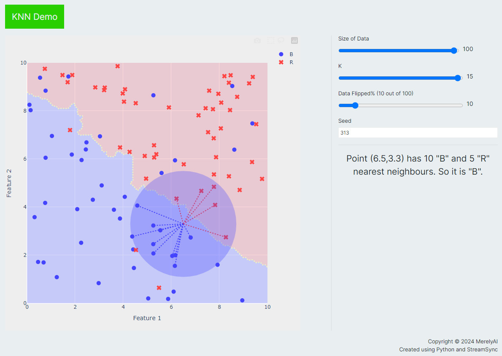

# ML Demo 
ML Demo using StreamSync

## Usage
```bash
pip install "streamsync[ds]"
git clone https://github.com/crxi/mldemo
cd mldemo
python serve.py --loglevel info
```

## Screenshot of KNN demo

